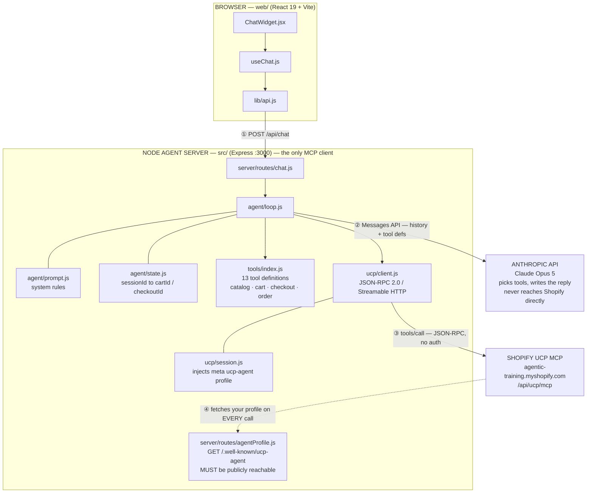
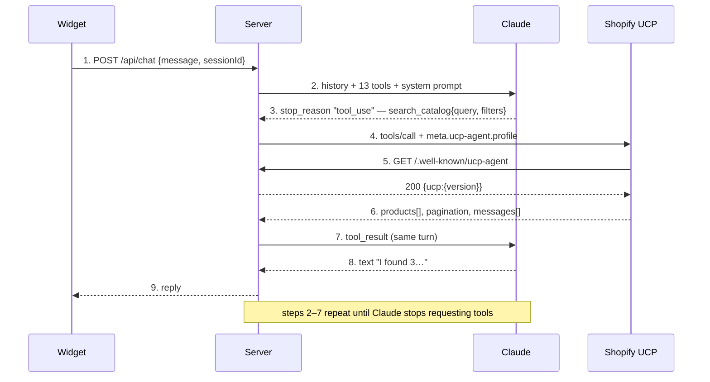

# Architecture — Chat UI ⇄ Claude ⇄ Shopify UCP/MCP

How the three parties connect and how data flows between them.

The key structural fact: **the browser never talks to Shopify, and Claude never talks
to Shopify.** The Node server is the only MCP client, and it sits between all three.

---

## 1. Topology



<details>
<summary>Same diagram in ASCII (for plain-text viewers)</summary>

```
                        ┌───────────────────────────────┐
                        │  BROWSER                      │
                        │  web/  (React 19 + Vite)      │
                        │                               │
                        │  ChatWidget.jsx               │
                        │    └─ useChat.js              │
                        │         └─ lib/api.js         │
                        └───────────────┬───────────────┘
                                        │
                              ① POST /api/chat
                                 { message, sessionId }
                                        │
                                        ▼
┌──────────────────────────────────────────────────────────────────────┐
│  NODE AGENT SERVER   src/   (Express, :3000)                         │
│                                              ← the only MCP client   │
│   server/routes/chat.js                                              │
│         │                                                            │
│         ▼                                                            │
│   agent/loop.js ─── agent/prompt.js      agent/state.js              │
│         │           (system rules)       (sessionId → cartId,        │
│         │                                 checkoutId)                │
│         ├─── tools/index.js   13 tool definitions                    │
│         │      catalog.js · cart.js · checkout.js · order.js         │
│         │                                                            │
│         └─── ucp/client.js    JSON-RPC 2.0 over Streamable HTTP      │
│              ucp/session.js   injects meta["ucp-agent"].profile      │
│              ucp/money.js  ·  ucp/errors.js                          │
│                                                                      │
│   server/routes/agentProfile.js   GET /.well-known/ucp-agent  ◄───┐  │
│   (MUST be publicly reachable)                                    │  │
└───────┬───────────────────────────────────────┬───────────────────┼──┘
        │                                       │                   │
  ② Messages API                          ③ tools/call              │
    history + tool defs                     JSON-RPC                │
    ANTHROPIC_API_KEY                       (no auth)               │
        │                                       │                   │
        ▼                                       ▼                   │
┌─────────────────────┐          ┌──────────────────────────┐       │
│  ANTHROPIC API      │          │  SHOPIFY UCP MCP         │       │
│  Claude Opus 5      │          │  agentic-training        │       │
│                     │          │    .myshopify.com        │       │
│  picks the tools,   │          │    /api/ucp/mcp          │       │
│  writes the reply   │          │                          │       │
│                     │          │  ④ fetches your profile ─┼───────┘
│  never reaches      │          │     server-side, on      │
│  Shopify directly   │          │     EVERY single call    │
└─────────────────────┘          └──────────────────────────┘
```

</details>

**Arrow ④ is the one most people miss.** Shopify makes an *inbound* HTTP request back to
your server on every tool call to fetch `meta["ucp-agent"].profile`. It is not a header
you send — it is a URL Shopify dereferences server-side. That is why `localhost:3000`
fails in development and you need a tunnel (ngrok / cloudflared) or a hosted profile.

---

## 2. One turn, step by step

User types *"show me t-shirts under $100"*:



<details>
<summary>Same sequence in ASCII</summary>

```
 Widget          Server           Claude          Shopify UCP
   │               │                │                  │
   │─1 POST ──────►│                │                  │
   │  /api/chat    │                │                  │
   │               │─2 messages ───►│                  │
   │               │  + 13 tools    │                  │
   │               │  + system      │                  │
   │               │                │                  │
   │               │◄─3 stop_reason─│                  │
   │               │   "tool_use"   │                  │
   │               │   search_catalog{query,filters}   │
   │               │                │                  │
   │               │─4 tools/call ─────────────────────►│
   │               │   + meta.ucp-agent.profile         │
   │               │                                    │
   │               │◄─5 GET /.well-known/ucp-agent ─────│
   │               │─── 200 {ucp:{version}} ───────────►│
   │               │                                    │
   │               │◄─6 products[], pagination, messages│
   │               │                │                  │
   │               │─7 tool_result─►│                  │
   │               │  (same turn,   │                  │
   │               │   loop back)   │                  │
   │               │                │                  │
   │               │◄─8 text ───────│                  │
   │               │   "I found 3…" │                  │
   │◄─9 reply ─────│                │                  │
```

</details>

Steps 2→7 **repeat** until Claude stops asking for tools. A checkout turn
("buy the medium in blue") can be four or five laps:
`get_product` → `create_cart` → `update_cart` (address) → `create_checkout`.

That is why the typing indicator matters — one user message can be 10+ seconds of
server-side work.

---

## 3. What the data looks like at each hop

| Hop | Shape |
|---|---|
| Widget → Server | `{ message: "...", sessionId: "abc" }` |
| Server → Claude | Full message history + 13 `tools[]` + system prompt |
| Claude → Server | `content: [{ type: "tool_use", name: "search_catalog", input: {...} }]` |
| Server → Shopify | `{"jsonrpc":"2.0","method":"tools/call","params":{"name":...,"arguments":{"meta":{"ucp-agent":{"profile":...}},"catalog":{...}}}}` |
| Shopify → Server | `result.content[0].text` — a **JSON string** that must be parsed again |
| Server → Claude | `{ type: "tool_result", tool_use_id, content: "<that JSON>" }` |
| Server → Widget | `{ reply: "...", sessionId, cart? }` |

Note the double-encoding on the way back: MCP wraps the UCP payload as a text block, so
`JSON.parse(result.content[0].text)` is mandatory. That belongs in `ucp/client.js`, once,
not scattered across the tool modules.

---

## 4. Why this shape, and not the alternatives

**Why not call Shopify from the browser?** Three blockers: you would have to ship the
Anthropic key to the client, the agent profile still needs server hosting, and cart /
checkout GIDs held client-side are tamperable.

**Why not Claude's MCP connector?** The Messages API can connect to remote MCP servers
directly, which would delete `ucp/client.js` entirely. It is a legitimate option, but it
costs you the interception point — and we need that point to inject the profile, hold
session state, enforce idempotency, and stop Claude from inventing a checkout. Worth
revisiting once the flow is stable.

---

## 5. Seven things this architecture has to enforce

1. **Session state lives server-side.** `agent/state.js` maps `sessionId → cartId /
   checkoutId`. Claude is told *"the current cart is X"* via the system prompt; it should
   never receive a cart GID from the client.

2. **Money never gets converted twice.** Shopify returns minor units (`15260` = $152.60).
   Keep it raw all the way to the UI and format once, at render. `ucp/money.js` is the
   single place that divides.

3. **`messages[]` is not decoration.** Out-of-stock, price change, and rejected discount
   codes arrive there with a `200 OK`. If `ucp/errors.js` does not surface them into the
   tool result, Claude will cheerfully tell the buyer their sold-out item is in the cart.

4. **Send buyer `context` on every cart write.** `create_cart` / `update_cart` without
   `context.address_country` + `currency` resolve against no market, find no inventory,
   and reject every line with `merchandise_out_of_stock` — for items that are in stock
   and that `create_checkout` accepts. The error names the wrong cause, so this one costs
   hours if you trust it. `catalog.js` and `cart.js` both send it from `config.locale`.

5. **`update_cart` replaces the line-items array; it does not patch it.** Despite the
   schema's `line_items[].id`, sending only the changed line silently drops every other
   line. Removal is done by omitting a line — `quantity: 0` returns an error. Every
   mutation therefore reads the cart, edits the full list, and writes it all back.

6. **`complete_checkout` needs an idempotency key** derived from the checkout ID, not a
   fresh UUID per attempt — otherwise a retry double-charges. That is the whole reason
   `utils/idempotency.js` exists.

7. **There is a human escape hatch.** Every cart / checkout response carries
   `continue_url` to Shopify's hosted checkout. When the agent gets stuck, handing that
   link to the buyer is the correct outcome, not a failure.

---

## Reference

| | |
|---|---|
| MCP endpoint | `https://agentic-training.myshopify.com/api/ucp/mcp` |
| Transport | Streamable HTTP, stateless (no session header) |
| MCP protocol | `2025-06-18` |
| UCP API version | `2026-08-25` |
| Discovery | `https://agentic-training.myshopify.com/.well-known/ucp` |
| Auth to Shopify | None — but `meta["ucp-agent"].profile` is required on every call |
| Payment handlers | `com.google.pay` (gpay), `dev.shopify.card` |
| Fulfillment | Shipping only, single destination |
